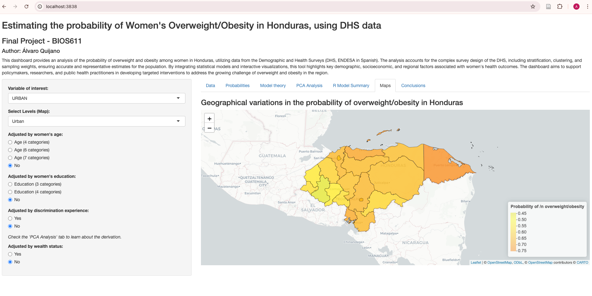

**BIOS 611 Data Science Project**

**Author**: Álvaro Quijano  
**Department**: UNC Biostatistics  

This project demonstrates the use of Docker, Shiny apps for data science workflows. Below are instructions for setting up the project environment, building and running Docker containers, and executing key project tasks.



---

Setting Up the Project

On macOS:

1. Build the Docker container:  
   Use the following command to build the Docker container:

```bash
   docker build --platform=linux/x86_64 -t shiny-sf-leaflet .
```

---

Project Structure

Directories:
- derived_data/ – Contains processed datasets.
- figures/ – Stores generated plots and visualizations.
- output/ – Contains reports and final outputs.

Makefile Tasks:

- Initialize directories:
  make init

- Clean and recreate directories:
  make clean

- Run the Shiny app locally:
  make run_shiny

- Generate the report:
  make report

- Build the Docker image:
  make build_docker

- Run the Shiny app in a Docker container:
  make run_shiny_container

---

Shiny Application Deployment

This project includes a Shiny app implementation that utilizes a custom Docker image called shiny-sf-leaflet. This image is configured to handle spatial data visualization with Shiny, sf, and leaflet.

Run the Shiny app inside a container:

```bash
docker run --rm \
  --platform linux/amd64 \
  -p 3838:3838 \
  -v "$(PWD):/home/rstudio/LHS0003" \
  shiny-sf-leaflet \
  Rscript -e "shiny::runApp('/home/rstudio/LHS0003/code/LHS000398/app.R', port = 3838, host = '0.0.0.0')"
```

or use the makefile as follows:

```bash
make run_shiny_container
```

Access the Shiny app:
After running the above command, the Shiny app will be accessible at:
http://localhost:3838


Acknowledgments

This project is part of the BIOS 611 Data Science curriculum at UNC Biostatistics. 
