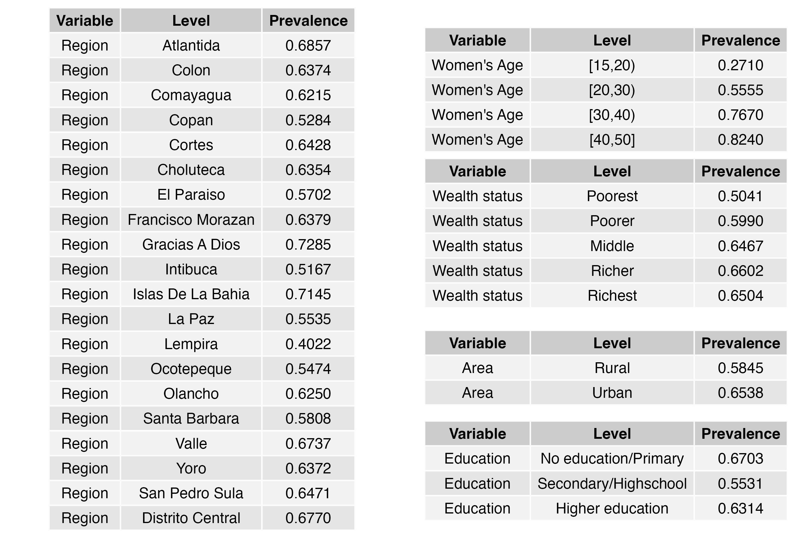
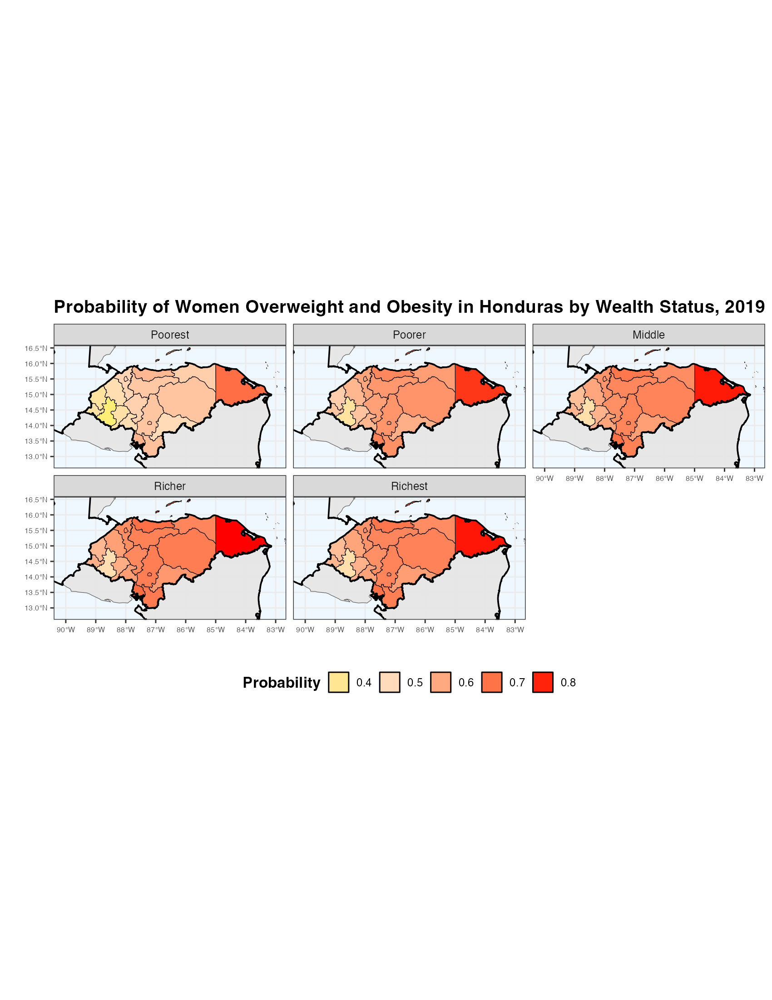
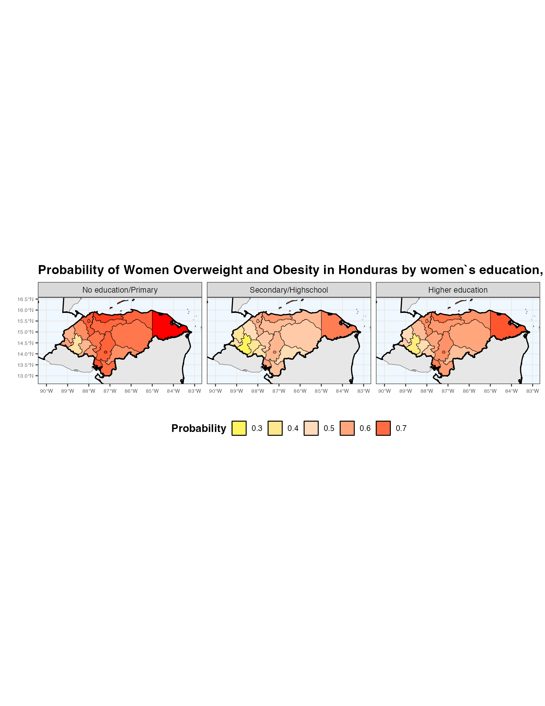
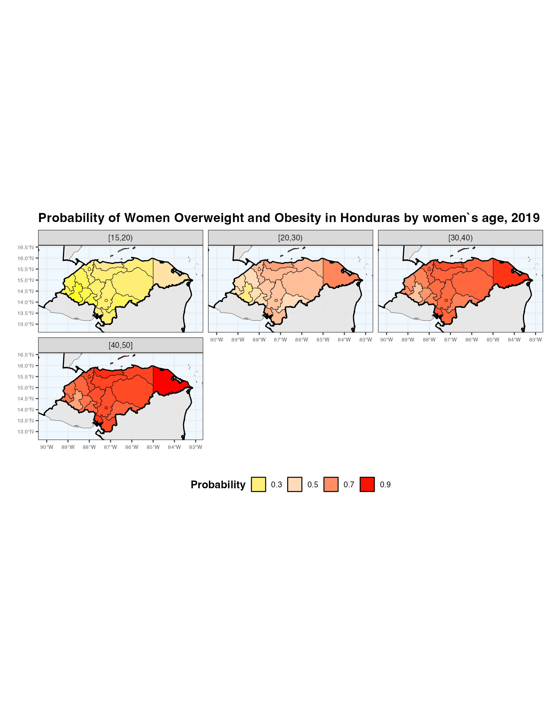
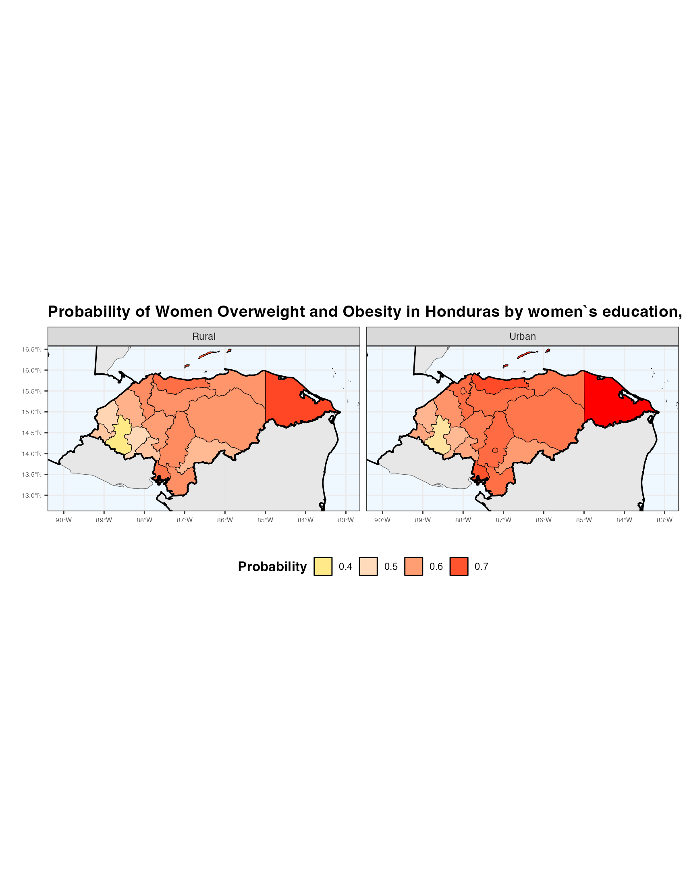

# Introduction

The current report pertains to one of the projects in the UNC Latin American Health Studies (UNC LHS), a personal initiative that involves using readily available data from Latin American countries, processing the datasets, deriving variables of interest, and addressing specific research questions. In this case, the project corresponds to LHS0003, and its objective is to estimate the probability of overweight and obesity in Honduras using Demographic and Health Survey (DHS) data and to map these estimates in a spatial format.

# Data and Methods

## Data

The probability of overweight and obesity among women aged 12 to 49 years in Honduras was estimated using data from the Honduran Demographic and Health Survey (DHS, ENDESA in spanish) with a complex survey design.

The Encuesta Nacional de Demografía y Salud (ENDESA) 2019 is a comprehensive survey conducted in Honduras to provide updated information on key indicators related to health, education, and population trends. This initiative, led by the National Institute of Statistics (INE) and the Secretariat of Health (SESAL), also tracks progress toward the Sustainable Development Goals (SDGs) and national plans. ENDESA covers diverse topics, including maternal and child health, reproductive health, nutritional trends, early childhood development, and domestic violence. The survey includes data collection through household and individual questionnaires for women, men, and children, alongside measures like anemia tests and water quality assessments. For this analysis, we used data exclusively from the women's questionnaire, focusing on women aged 15–49. This allows us to examine health, reproductive, and social indicators specific to this population.

The full survey and details can be accessed at:  
[https://ine.gob.hn/v4/endesa/](https://ine.gob.hn/v4/endesa/)


## Methods
The data was modeled using the *survey* package in R, that accounts for the multi-stage sampling design,  specifically the primary sampling units (PSUs), stratification variable, and survey weights to ensure nationally representative estimates. To estimate probability rates, a logistic regression model with a logit link function was fitted using the *svyglm* function, which is specifically designed for complex survey data.  This approach incorporate the survey design in the estimates and provides robust variance estimates. The response variable was overweight/obesity, modeled as a function of  predictors such as women's age categories, wealth, education level, wealth index and others. This method leverages the flexibility of generalized linear models while appropriately handling the complexities of survey sampling, ensuring accurate and reliable prevalence estimates that account for the design's stratification, clustering, and weighting.

# Results 

##  Estimating the univariate prevalences of overweight and obesity

```{r include_image, echo=FALSE, out.width='80%', fig.align='center', fig.cap="Prevalence of age categories in the study."}

```

The prevalence of overweight and obesity among women aged 12 to 49 in Honduras reveals significant disparities across regions, age groups, wealth status, areas of residence, and education levels. The highest prevalence is observed in the regions of Gracias A Dios (72.85%) and Islas De La Bahia (71.45%), while the lowest is in Lempira (40.22%), reflecting substantial regional variation. Overweight and obesity rates increase consistently with age, from 27.10% in women aged 15-20 to 82.40% in those aged 40-50. Urban areas (65.38%) show higher prevalence compared to rural areas (58.45%), likely due to differences in lifestyle and dietary patterns. Wealthier groups have higher prevalence rates, peaking at 66.02% among richer individuals, though the trend stabilizes among the richest. Women with no or primary education (67.03%) are most affected, while those with secondary or high school education show a lower prevalence (55.31%). These findings highlight the need for targeted interventions, particularly among younger women, rural populations, and those with lower education levels, to address the growing public health concern of obesity and overweight in Honduras.

## Methodology

To estimate the probability of overweight and obesity among women in Honduras, logistic regression was employed, accommodating the complexities of survey design as described by Lumley (2010). The DHS employs a stratified, multistage cluster sampling design, where sampling weights, strata, and primary sampling units (PSUs) must be accounted for to produce unbiased and efficient estimates.

Let \( y_i \) denote the binary outcome variable, where \( y_i = 1 \) if the \( i \)-th individual is classified as overweight or obese, and \( y_i = 0 \) otherwise. The probability of \( y_i = 1 \) is modeled as:

\[
P(y_i = 1 \mid X_i) = \frac{\exp(\beta_0 + \beta_1 x_{i1} + \beta_2 x_{i2} + \dots + \beta_k x_{ik})}{1 + \exp(\beta_0 + \beta_1 x_{i1} + \beta_2 x_{i2} + \dots + \beta_k x_{ik})},
\]

where \( X_i = (x_{i1}, x_{i2}, \dots, x_{ik}) \) represents the vector of predictor variables for individual \( i \), and \( \beta_0, \beta_1, \dots, \beta_k \) are the regression coefficients to be estimated.

To account for the complex survey design, the weighted likelihood function is maximized:

\[
L(\beta) = \prod_{i=1}^n \left[ P(y_i = 1 \mid X_i)^{y_i} \cdot \left(1 - P(y_i = 1 \mid X_i)\right)^{1-y_i} \right]^{w_i},
\]

where \( w_i \) denotes the survey sampling weight for individual \( i \). Variance estimation incorporates the design's stratification and clustering by using a Taylor-series linearization approach or replicate weights, as implemented in survey analysis software (Lumley, 2010).

This methodology allows for valid statistical inferences that respect the structure of the complex survey data and the population it represents.


## Overweight maps


```{r include_image5, echo=FALSE, out.width='100%', fig.align='center', fig.cap="Map of overweight/obesity probabilities by wealth index"}

```

```{r include_image2, echo=FALSE, out.width='100%', fig.align='center', fig.cap="Map of overweight/obesity probabilities by women`s education"}

```

```{r include_image3, echo=FALSE, out.width='100%', fig.align='center', fig.cap="Map of overweight/obesity probabilities by women`s age"}

```


```{r include_image4, echo=FALSE, out.width='100%', fig.align='center', fig.cap="Map of overweight/obesity probabilities by area of residence"}

```

## Conclusions

### Logistic Regression Model

Below are the key findings using the logistic regression model that examines factors associated with being overweight/obese using ENDESA (DHS) data:

##### Age Groups

As age increases, the likelihood of being overweight also increases. This is evident from the positive estimates for age categories 20–30, 30–40, and 40–50, with the highest estimate in the 40–50 age group.

##### Education Level

Higher education levels are associated with a lower likelihood of being overweight. This is indicated by the negative estimates for "Secondary/Highschool" and "Higher Education" compared to the reference category.

##### Discrimination Score

The discrimination score is positively associated with the likelihood of being overweight, suggesting that perceived discrimination may be a contributing factor.

##### Wealth Index

Higher wealth is associated with an increased likelihood of being overweight. This trend is observed across all wealth categories, with the richest group showing a consistently high estimate.

##### Significance

Most variables are statistically significant (p < 0.001), indicating strong evidence for their associations with being overweight.

Overall, this model suggests that age, wealth, and discrimination are positively associated with overweight status, while higher education levels are protective. The insights from this analysis can guide targeted interventions addressing these factors.


### Reference

Lumley, T. (2011). *Complex surveys: a guide to analysis using R*. John Wiley & Sons.


